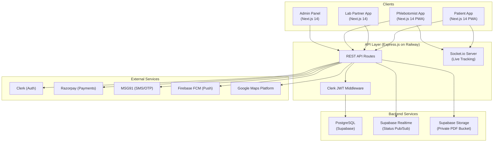

# LabEase — Implementation Plan
### "The Zomato for Diagnostic Tests" — Full-Stack Marketplace Platform

## Summary

LabEase is a **three-sided marketplace** connecting Patients, Diagnostic Labs, and Phlebotomists. The platform consists of **3 client apps** (Patient, Lab Partner, Phlebotomist) + **1 Admin Panel**, a shared **Express.js API**, and a **Supabase** backend for database, storage, and realtime.

The PRD is comprehensive (1000+ lines), covering 5 release phases over 26 weeks. This plan proposes building **Phase 1 (Platform Foundation)** first, then iterating.

---

## User Review Required

> [!IMPORTANT]
> **Monorepo Strategy**: The PRD specifies Next.js 14 for all 3 apps + Express backend. I propose a **Turborepo monorepo** with the following workspace structure. This keeps shared code (types, UI components, API client) in one place while deploying each app independently.

> [!IMPORTANT]
> **Supabase Setup**: We need a Supabase project for PostgreSQL, Storage, and Realtime. Do you already have a Supabase project, or should I create one via the Supabase MCP?

> [!WARNING]
> **External Service Accounts Required** — The following require accounts/API keys before integration:
> - **Clerk** — Auth provider (multi-role, OTP, social login)
> - **Razorpay** — Payments + Payouts
> - **MSG91** — SMS/OTP
> - **Resend** — Transactional email
> - **Firebase** — Push notifications (FCM)
> - **Google Maps Platform** — Maps, Geocoding, Distance Matrix
> - **Sentry** — Error monitoring
> - **PostHog** — Analytics
>
> For Phase 1, only **Clerk** and **Supabase** are hard requirements. The rest can be stubbed.

---

## Open Questions

> [!IMPORTANT]
> 1. **Deployment Targets**: PRD says Railway (backend) + Vercel (frontend). Should I configure for these from the start, or develop locally first?
> 2. **Clerk Account**: Do you have a Clerk project already? We need publishable + secret keys for auth.
> 3. **Phase Scope**: Should I build **all 5 phases** in sequence, or focus only on **Phase 1 (Foundation)** and get it running before proceeding?
> 4. **Design System**: The [DESIGN (1).md](file:///c:/Users/RUPESH/OneDrive/Desktop/Labease/DESIGN%20(1).md) specifies a "Clinical Clarity" theme with Inter font, Medical Blue (#0052CC) primary, Care Teal (#00A3BF) secondary. Should I follow this exactly?

---

## Proposed Architecture

```
labease/
├── apps/
│   ├── patient/          # Next.js 14 (App Router) — Patient-facing PWA
│   ├── lab/              # Next.js 14 (App Router) — Lab Partner Dashboard
│   ├── phlebotomist/     # Next.js 14 (App Router) — Phlebotomist PWA
│   ├── admin/            # Next.js 14 (App Router) — Platform Admin Panel
│   └── api/              # Express.js + Socket.io — Backend API
├── packages/
│   ├── ui/               # Shared UI component library (design system)
│   ├── types/            # Shared TypeScript types (data models, enums)
│   ├── config/           # Shared configs (ESLint, TSConfig, etc.)
│   └── database/         # Supabase client, migrations, seed data
├── turbo.json
├── package.json
└── .env.example
```

### System Architecture Diagram



---

## Proposed Changes — Phase 1 (Platform Foundation, Weeks 1–5)

Phase 1 focuses on getting the **monorepo scaffolded**, **auth working across all roles**, **database schema deployed**, and the **Admin Panel + Lab Partner onboarding** flow operational.

---

### 1. Monorepo Setup & Shared Infrastructure

#### [NEW] Root `package.json` + `turbo.json`
- Initialize Turborepo monorepo with workspaces for `apps/*` and `packages/*`
- Configure shared scripts: `dev`, `build`, `lint`, `db:migrate`

#### [NEW] `packages/types/`
- All shared TypeScript types and enums from the data model:
  - `User`, `LabPartner`, `FamilyMember`, `Address`, `Test`, `Package`, `Booking`, `BookingItem`, `PhlebotomistAssignment`, `PhlebotomistLocation`, `Report`, `Review`, `Payout`
  - Enums: `UserRole`, `LabStatus`, `BookingStatus`, `PaymentStatus`, `CollectionMode`, `AssignmentStatus`, `PayoutStatus`

#### [NEW] `packages/config/`
- Shared ESLint config (`eslint-config-custom`)
- Shared TypeScript config (`tsconfig-base.json`)

#### [NEW] `packages/database/`
- Supabase client initialization (server + browser clients)
- Database migration files for all core tables
- Row-Level Security (RLS) policies
- Seed data for development

#### [NEW] `packages/ui/`
- Design system implementation based on [DESIGN (1).md](file:///c:/Users/RUPESH/OneDrive/Desktop/Labease/DESIGN%20(1).md):
  - CSS custom properties for the "Clinical Clarity" color palette
  - Typography tokens (Inter font, all weight/size variants)
  - Spacing scale (8px grid)
  - Elevation/shadow tokens
  - Base components: Button, Input, Card, Badge, Modal, StatusChip

---

### 2. Database Schema (Supabase PostgreSQL)

#### [NEW] Migration: `001_initial_schema.sql`

All 12 core tables from the PRD data model (Section 15):

| Table | Key Fields |
|-------|-----------|
| `users` | id, clerk_id, role (enum), name, email, phone, phone_verified |
| `lab_partners` | id, owner_user_id, status (enum), address, lat/lng, service_radius, nabl_cert_url, commission_rate, rating_avg |
| `family_members` | id, patient_user_id, name, dob, gender, relation |
| `addresses` | id, user_id, label, full_address, lat, lng, is_default |
| `tests` | id, lab_id, code, name, description, sample_type, prep_instructions, tat_hours, price, category, is_active |
| `packages` | id, lab_id, name, description, price, is_active |
| `package_tests` | package_id, test_id (join table) |
| `bookings` | id, booking_number, patient_user_id, family_member_id, lab_id, collection_mode, address_id, slot_datetime, status, payment_status, total_amount, commission, lab_payout |
| `booking_items` | id, booking_id, test_id, package_id, price_at_booking |
| `phlebotomist_assignments` | id, booking_id, phlebotomist_user_id, status, collection_photo_url, otp_confirmed, failure_reason |
| `phlebotomist_locations` | id, phlebotomist_user_id, lat, lng, is_online, recorded_at |
| `reports` | id, booking_id, uploaded_by, file_url, version, is_active |
| `reviews` | id, booking_id, patient_user_id, lab_rating, lab_review_text, phlebotomist_rating, phlebotomist_note |
| `payouts` | id, lab_id, period_start, period_end, gross, commission_deducted, net, status |
| `audit_logs` | id, user_id, action, entity_type, entity_id, old_values, new_values, timestamp |
| `promo_codes` | id, code, type, value, start_date, end_date, is_active |

#### [NEW] Migration: `002_rls_policies.sql`
- RLS policies enforcing RBAC from Section 17:
  - Patients: own bookings, reports, family members only
  - Lab staff: own lab's data only, no cross-lab access
  - Phlebotomists: own assignments only
  - Platform admin: full access, all actions audit-logged

#### [NEW] Migration: `003_indexes.sql`
- Performance indexes: `lab_partners(lat, lng)`, `bookings(status, lab_id)`, `phlebotomist_locations(recorded_at)`, `tests(lab_id, is_active)`

---

### 3. API Server (Express.js)

#### [NEW] `apps/api/`
- Express.js server with:
  - Clerk JWT middleware for all protected routes
  - Role-based route guards (`requireRole('lab_staff')`, etc.)
  - Supabase service-role client for database operations

**Phase 1 API Routes:**

| Method | Route | Purpose |
|--------|-------|---------|
| `POST` | `/api/auth/webhook` | Clerk webhook — sync user to DB on signup |
| `GET` | `/api/users/me` | Get current user profile |
| `PUT` | `/api/users/me` | Update profile |
| **Lab Partner Routes** | | |
| `POST` | `/api/labs/onboard` | Submit lab onboarding application |
| `GET` | `/api/labs/:id` | Get lab profile |
| `PUT` | `/api/labs/:id` | Update lab profile |
| `PUT` | `/api/labs/:id/service-area` | Set home collection service area |
| `PUT` | `/api/labs/:id/slots` | Configure time slots |
| **Admin Routes** | | |
| `GET` | `/api/admin/labs` | List all lab applications |
| `PUT` | `/api/admin/labs/:id/review` | Approve/reject lab |
| `GET` | `/api/admin/stats` | Platform-wide statistics |

---

### 4. Authentication (Clerk Integration)

#### All Apps — Clerk Setup
- Clerk provider wrapping all Next.js apps
- Multi-role support: `patient`, `lab_staff`, `phlebotomist`, `platform_admin`
- Clerk webhook → Express API → inserts/updates `users` table in Supabase
- JWT middleware on Express validates Clerk session tokens
- Phone OTP verification on patient onboarding

---

### 5. Admin Panel (Platform Operations)

#### [NEW] `apps/admin/`
Next.js 14 App Router application for LabEase operations team.

**Pages:**

| Route | Page | Features |
|-------|------|----------|
| `/` | Dashboard | Total labs, pending reviews, active orders, platform stats |
| `/labs` | Lab Applications | List of all lab submissions with status filter (Pending/Verified/Live/Suspended) |
| `/labs/[id]` | Lab Review Detail | Full lab application with NABL cert viewer, approve/reject buttons with comments |
| `/orders` | Order Monitor | (Placeholder for Phase 2) |
| `/settings` | Platform Settings | Commission rate management, global config |

**Key Components:**
- `LabApplicationCard` — Shows lab name, location, status badge, submission date
- `LabReviewPanel` — Detailed view with certificate viewer, address map, approve/reject actions
- `StatCard` — Dashboard metric cards (labs onboarded, pending reviews, etc.)
- `DataTable` — Reusable table with sorting, filtering, pagination

---

### 6. Lab Partner App — Onboarding & Profile

#### [NEW] `apps/lab/`
Next.js 14 App Router application for lab partners.

**Phase 1 Pages:**

| Route | Page | Features |
|-------|------|----------|
| `/onboard` | Onboarding Flow | Multi-step form: Business info → Address → NABL cert upload → Bank details → Submit |
| `/` | Dashboard | (Placeholder — shows onboarding status until approved) |
| `/profile` | Profile Management | Edit lab name, logo, photos, description, working hours |
| `/branches` | Branch Management | Add/manage multiple branches as separate location entities |
| `/service-area` | Service Area Config | Map-based service area definition (radius or polygon) |
| `/slots` | Slot Management | Calendar view to configure available time slots per day |

**Key Components:**
- `OnboardingWizard` — Multi-step form with progress indicator
- `ServiceAreaMap` — Google Maps integration for drawing service radius
- `SlotCalendar` — Weekly calendar with toggleable time slots
- `StatusBanner` — Shows "Pending Review" / "Verified" / "Live" status prominently

---

### 7. Patient App — Scaffold Only (Phase 1)

#### [NEW] `apps/patient/`
- Scaffold Next.js 14 app with Clerk auth
- Landing page with "Coming Soon" or location permission request
- Auth flow: Google OAuth + email/password signup → phone OTP → profile completion
- PWA manifest + service worker setup

---

### 8. Phlebotomist App — Scaffold Only (Phase 1)

#### [NEW] `apps/phlebotomist/`
- Scaffold Next.js 14 app with Clerk auth
- Login page (credential-based, issued by lab/platform)
- PWA manifest + service worker setup (offline support foundation)

---

## File Summary — Phase 1 Deliverables

| Category | Files | Count |
|----------|-------|-------|
| Root / Config | `package.json`, `turbo.json`, `.env.example`, `.gitignore` | 4 |
| `packages/types` | Shared types, enums | ~5 |
| `packages/config` | ESLint, TSConfig | ~4 |
| `packages/database` | Supabase client, 3 migration files, seed | ~6 |
| `packages/ui` | Design system CSS, 8–10 base components | ~12 |
| `apps/api` | Express server, middleware, 10+ route handlers | ~15 |
| `apps/admin` | 4 pages, 6+ components, layouts | ~15 |
| `apps/lab` | 6 pages, 6+ components, layouts | ~18 |
| `apps/patient` | Scaffold — 2 pages, auth, PWA | ~8 |
| `apps/phlebotomist` | Scaffold — 2 pages, auth, PWA | ~8 |
| **Total** | | **~95 files** |

---

## Verification Plan

### Automated Tests
- `npm run lint` — ESLint passes on all workspaces
- `npm run build` — All 4 Next.js apps + Express API build without errors
- `npm run dev` — All dev servers start successfully on different ports

### Manual Verification
1. **Auth flow**: Sign up as patient → verify phone → profile completion
2. **Lab onboarding**: Sign up as lab_staff → complete onboarding form → submit
3. **Admin review**: Login as admin → see pending lab → approve → lab status updates to "Live"
4. **Database**: Verify all tables created with correct schema in Supabase dashboard
5. **RLS**: Verify a patient cannot access another patient's data via direct Supabase query

### Development Server Ports
| App | Port |
|-----|------|
| Patient | `:3000` |
| Lab Partner | `:3001` |
| Phlebotomist | `:3002` |
| Admin | `:3003` |
| API Server | `:4000` |

---

## Phase 2–5 Roadmap (For Reference)

| Phase | Weeks | Focus |
|-------|-------|-------|
| **Phase 2** — Marketplace Core | 6–11 | Patient discovery feed, lab profiles, test catalog CRUD, cart + checkout, Razorpay, order accept/reject |
| **Phase 3** — Field Operations | 12–17 | Phlebotomist task management, live GPS tracking (Socket.io), collection workflow, OTP confirmation |
| **Phase 4** — Reports & Revenue | 18–23 | Report upload/viewer, health history, ratings/reviews, revenue dashboards, payouts, promo codes |
| **Phase 5** — Hardening & Launch | 24–26 | WCAG audit, security pen testing, load testing, beta program, production launch |
